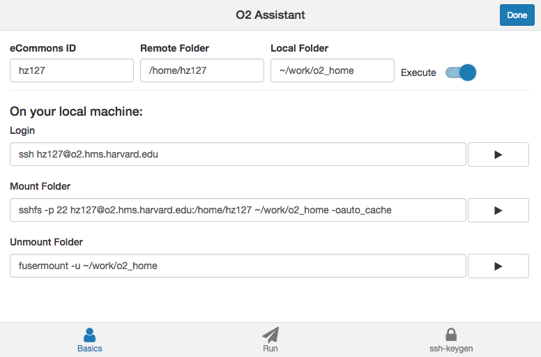
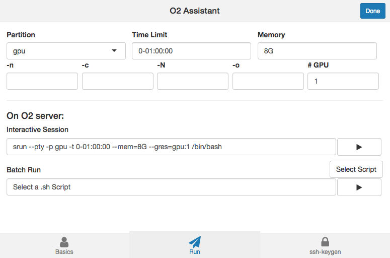
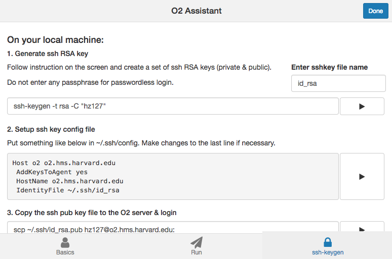
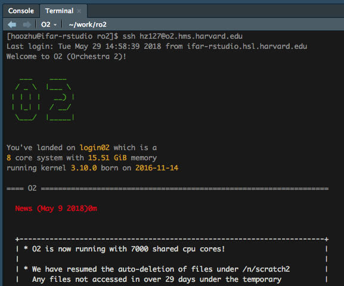

# ro2

This is an unofficial utility package to the O2 (Orchestra) Server in Harvard Medical School. The interactive RStudio Addin allows you to use point & click to easily do O2-related command-line tasks. 

## Features
### Login Panel


### Script Executing Panel


### sshkey-gen setup Panel


### RStudio Terminal Panel


## Install
```r
devtools::install_github("hebrewseniorlife/ro2")
```
